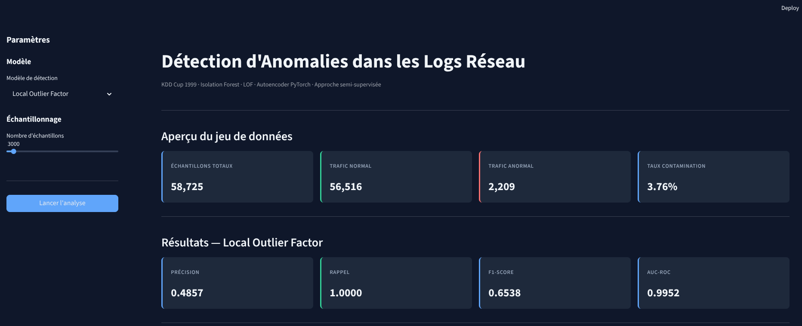
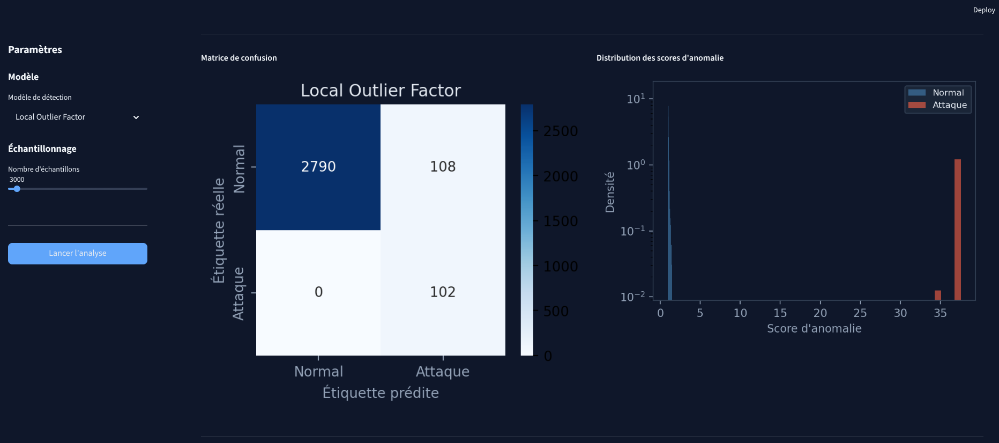
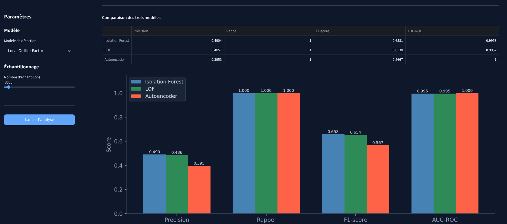

# Détection d'Anomalies dans les Logs Réseau


## Présentation

Ce projet compare deux paradigmes de détection d'anomalies appliqués au trafic réseau : l'apprentissage automatique classique (Isolation Forest, Local Outlier Factor) et l'apprentissage profond (Autoencoder PyTorch).

Les modèles sont entraînés exclusivement sur du trafic normal, puis évalués sur un ensemble complet contenant des attaques — approche dite **semi-supervisée**, qui simule un scénario réaliste où les signatures d'attaques sont inconnues au moment de l'entraînement.

Ce projet se distingue du projet [Adversarial Attacks on IDS](https://github.com/fsouilhi/adversarial-ids) par son paradigme : ici, **aucune étiquette n'est utilisée à l'entraînement**. Les modèles apprennent uniquement la structure du trafic normal et signalent tout écart comme anomalie potentielle.

---

## Démo interactive

> **[Lancer la démo Streamlit](https://network-anomaly-detection-pvqxqknokaqmm4xyaj3zba.streamlit.app)**

La démo permet de comparer les trois modèles en temps réel, de visualiser les scores d'anomalie et de faire varier le nombre d'échantillons.

---

## Structure du dépôt

```
network-anomaly-detection/
├── notebook/
│   └── anomaly_detection.ipynb    # Notebook principal (Google Colab)
├── data/                          # Figures générées (gitignorées)
├── requirements.txt
└── README.md
```

---


## Screenshots







## Méthodologie

### 1. Jeu de données — KDD Cup 1999 (sous-ensemble HTTP)

Le jeu de données KDD Cup 1999 est le benchmark historique de référence pour la détection d'intrusions réseau, produit par le MIT Lincoln Laboratory dans le cadre du programme DARPA 1998. Nous utilisons le sous-ensemble HTTP, accessible nativement via `sklearn.datasets.fetch_kddcup99` — sans dépendance externe.

**Caractéristiques :**

| | Valeur |
|---|---|
| Échantillons | 58 725 flux |
| Features | 3 (duration, src\_bytes, dst\_bytes) après filtrage variance nulle |
| Trafic normal | 56 516 (96.24 %) |
| Trafic attaque | 2 209 (3.76 %) |

**Types d'attaques présents :** back (DoS), phf (R2L), ipsweep (Probe), satan (Probe)

**Observations EDA :**
- Le jeu de données est fortement déséquilibré (~96 % de trafic normal) — caractéristique réaliste d'un trafic réseau en production.
- Les features `src_bytes` et `dst_bytes` présentent des distributions très distinctes entre trafic normal et attaque, offrant une séparabilité élevée.
- Les attaques DoS (`back`) représentent 99.7 % du trafic anormal, ce qui explique les AUC-ROC élevés obtenus.

---

### 2. Prétraitement (stratégie semi-supervisée)

| Étape | Détail |
|---|---|
| Suppression features à variance nulle | Réduction du vecteur à 3 features informatives |
| Binarisation des étiquettes | `normal. → 0`, toute attaque `→ 1` |
| Normalisation | StandardScaler ajusté sur le trafic normal uniquement |
| Découpage | Entraînement sur normal (85 %), évaluation sur l'ensemble complet |

---

### 3. Modèles

#### Isolation Forest (Liu et al., 2008)
Détecte les anomalies via des arbres de décision aléatoires. Les points anormaux, naturellement rares et distincts, sont isolés plus rapidement — leur chemin moyen dans les arbres est plus court. Le score d'anomalie est inversement proportionnel à cette longueur de chemin.

#### Local Outlier Factor (Breunig et al., 2000)
Mesure la densité locale d'un point relativement à ses voisins. Un point dont la densité est nettement inférieure à celle de ses voisins reçoit un score LOF élevé.

#### Autoencoder PyTorch

| Composant | Couches | Activation |
|-----------|---------|------------|
| Encodeur | `dim_entrée → 64 → 32 → 16` | ReLU |
| Décodeur | `16 → 32 → 64 → dim_entrée` | ReLU / Identité |

Perte : MSE — Optimiseur : Adam (`lr=1e-3`) — Seuil : percentile 95 des erreurs de reconstruction sur la validation (trafic normal uniquement).

---

## Résultats

| Modèle | Précision | Rappel | F1-score | AUC-ROC | Average Precision |
|--------|-----------|--------|----------|----------|-------------------|
| Isolation Forest | 0.5091 | 1.0000 | 0.6747 | 0.9949 | 0.8749 |
| Local Outlier Factor | 0.5373 | 1.0000 | 0.6991 | 0.9962 | 0.8936 |
| Autoencoder | 0.4373 | 1.0000 | 0.6085 | **1.0000** | **0.9989** |

**Analyse :** Les trois modèles atteignent un rappel parfait (1.0) — aucune attaque n'est manquée. L'Autoencoder obtient un AUC-ROC de 1.0 et une Average Precision de 0.9989, ce qui indique une séparation quasi-parfaite entre trafic normal et anormal dans l'espace des erreurs de reconstruction. Le LOF offre le meilleur F1-score parmi les approches ML classiques. La précision plus faible de l'Autoencoder s'explique par un taux de faux positifs légèrement plus élevé, inhérent au seuil fixé au percentile 95.

Dans un contexte de sécurité réseau, le **rappel est la métrique prioritaire** : un faux négatif (attaque non détectée) est bien plus coûteux qu'un faux positif (alerte injustifiée).

---

## Reproduire les résultats

### Sur Google Colab (recommandé)

[](https://colab.research.google.com/github/fsouilhi/network-anomaly-detection/blob/main/notebook/anomaly_detection.ipynb)

Exécuter toutes les cellules : `Exécution → Tout exécuter`. Toutes les dépendances sont gérées par la première cellule.

### En local

```bash
git clone https://github.com/fsouilhi/network-anomaly-detection.git
cd network-anomaly-detection
python3 -m venv venv && source venv/bin/activate
pip install -r requirements.txt
jupyter notebook notebook/anomaly_detection.ipynb
```

---

## Dépendances

```
torch>=2.0
scikit-learn>=1.3
pandas>=2.0
numpy>=1.24
matplotlib>=3.7
seaborn>=0.12
```

---

## Références

- Liu, F. T. et al. (2008). *Isolation Forest*. ICDM 2008.
- Breunig, M. M. et al. (2000). *LOF: Identifying Density-Based Local Outliers*. SIGMOD 2000.
- Tavallaee, M. et al. (2009). *A Detailed Analysis of the KDD CUP 99 Data Set*. IEEE CISDA 2009.

---

## Auteur

**Fatima Souilhi** — [@fsouilhi](https://github.com/fsouilhi)  
